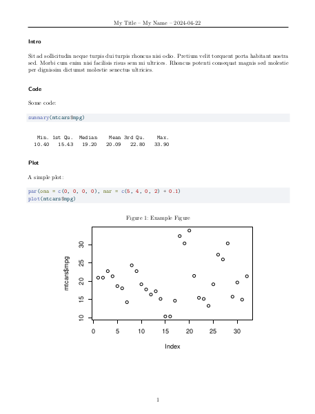

# compact-pdf Quarto Format

A Quarto format for compact PDF documents. Good for short reports, homework assignments, etc.

## Example

<a href="template.pdf"></a>

[[Source code](template.qmd)]

## Installation and usage

To add the template *to a project* (Quarto extensions cannot be installed globally):

```bash
quarto add arcruz0/quarto-compact
```

Next, simply use the "compact-pdf" format instead of "pdf" in your Quarto documents. For example:

```yaml
---
title: "My Title"
author: "My Name"
date: today
format: compact-pdf
---
```

All [PDF options](https://quarto.org/docs/reference/formats/pdf.html) should work as in the "pdf" format.
